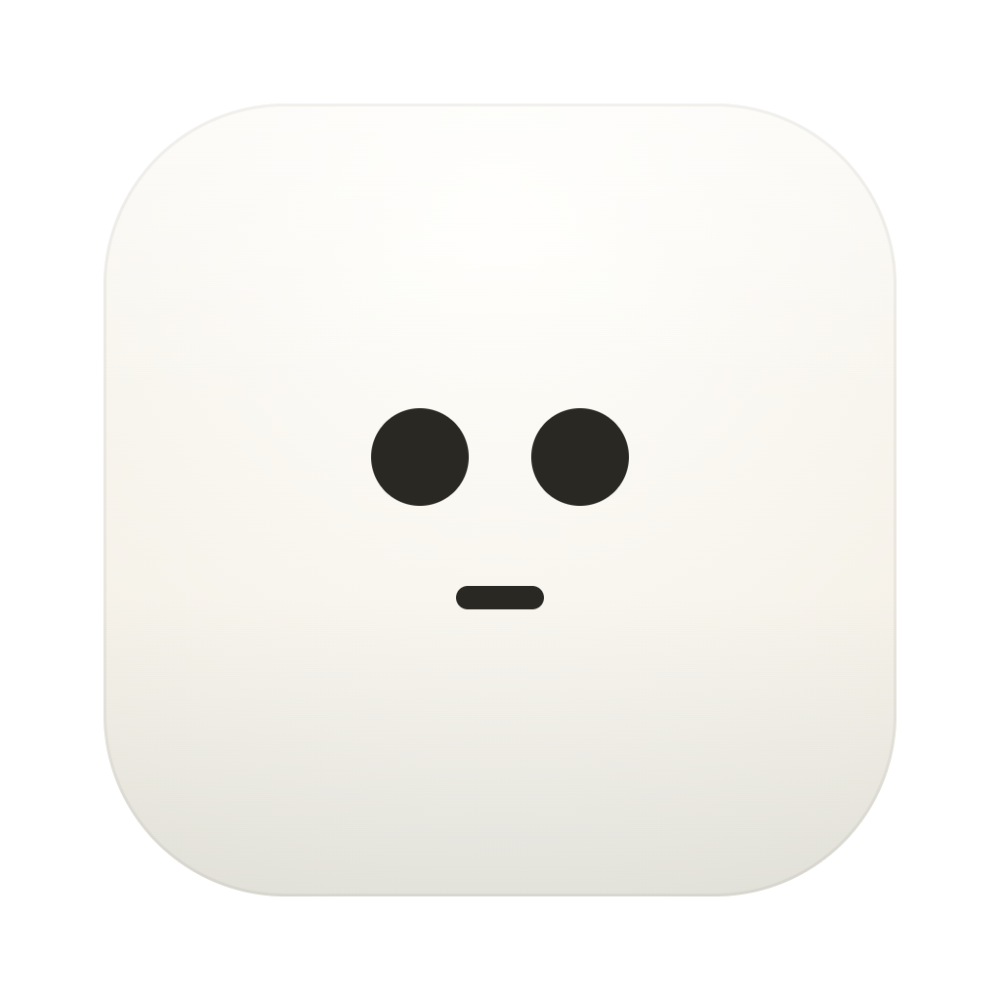
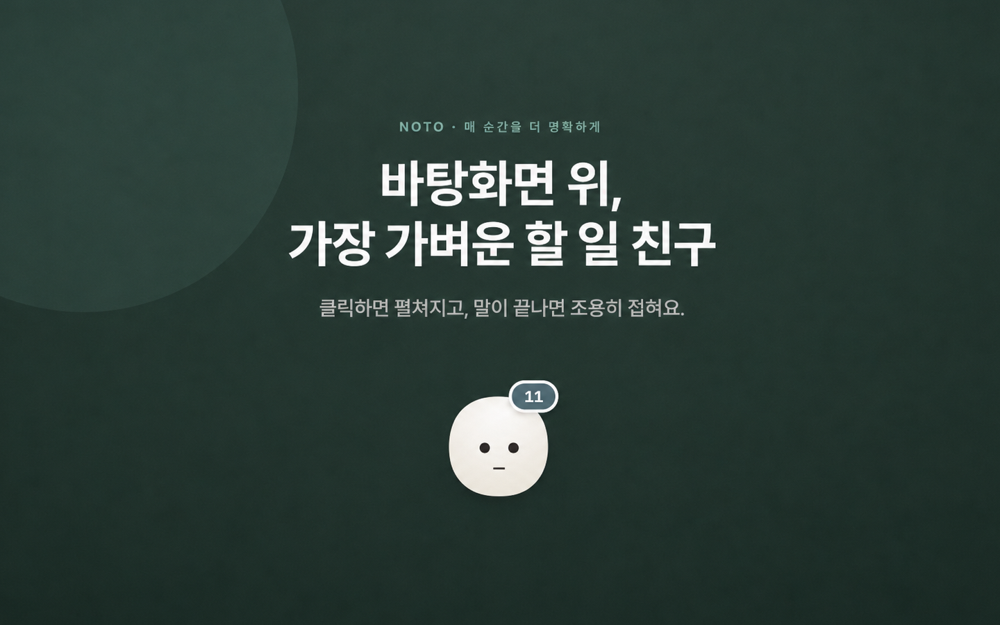
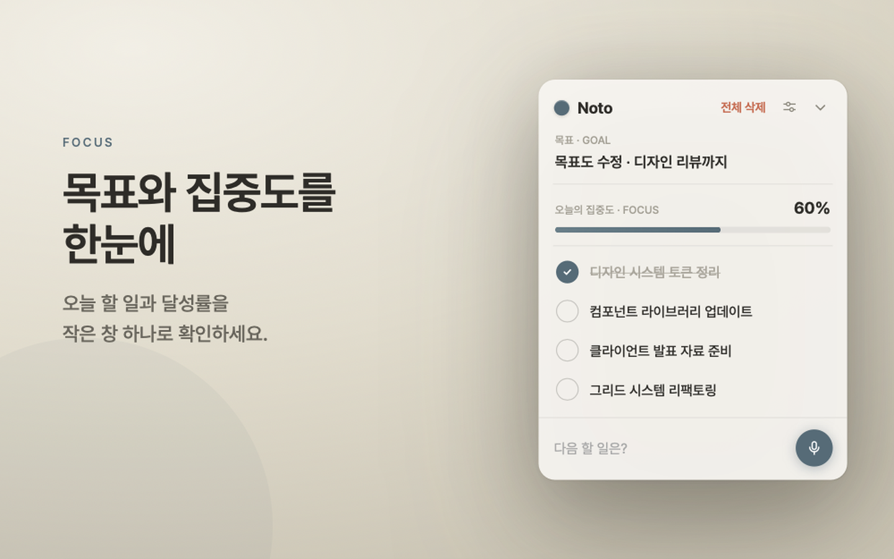
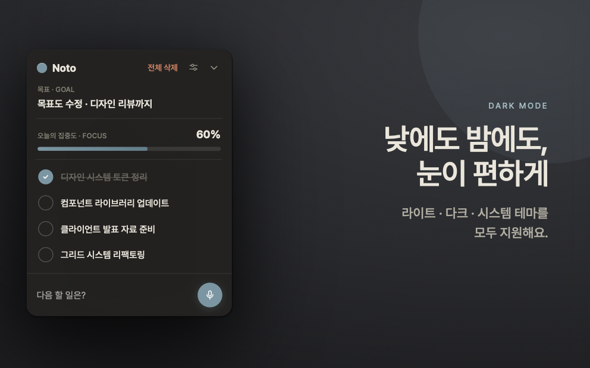
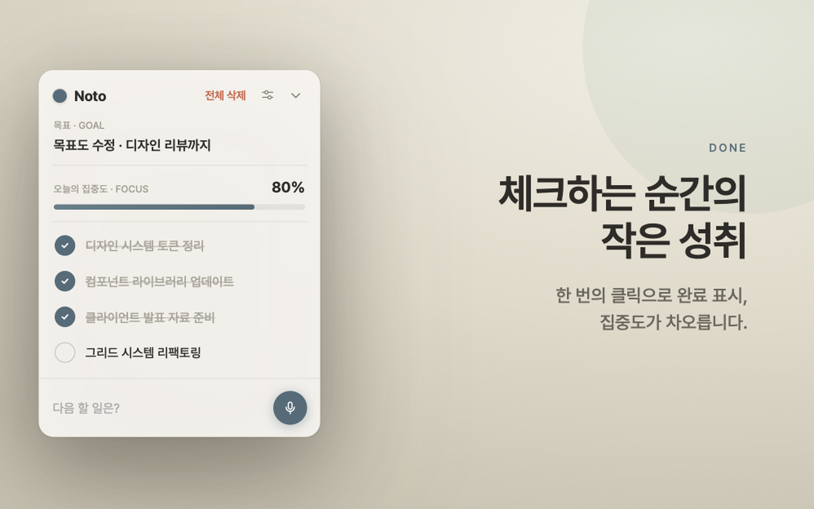
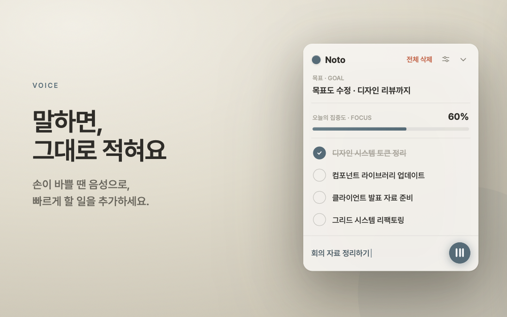
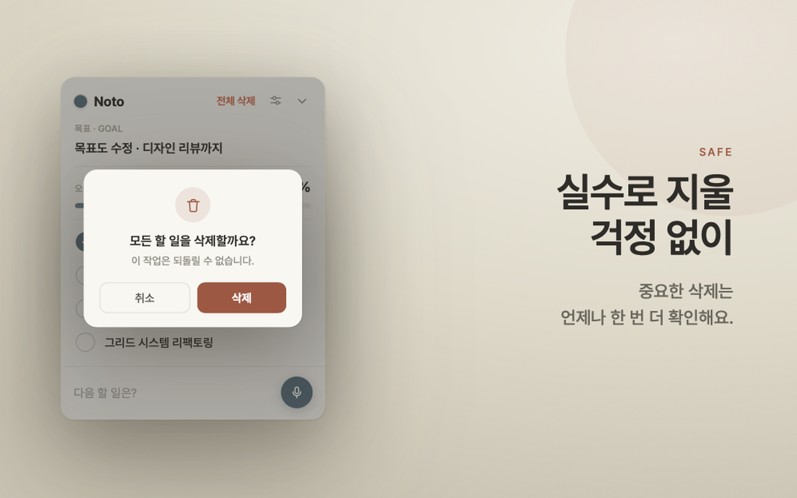
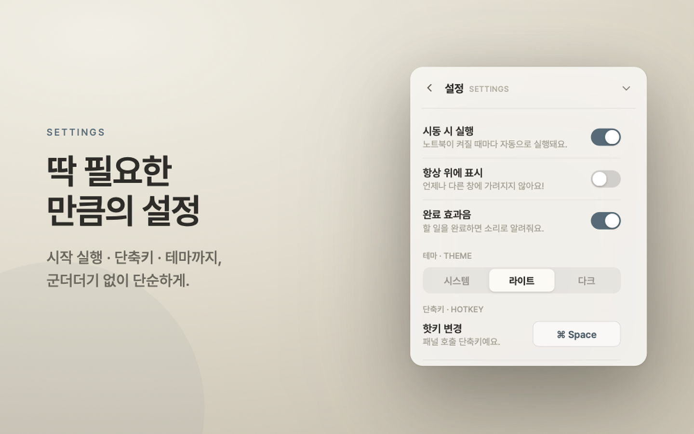

# Noto

  

Noto는 오늘의 목표와 할 일을 바탕화면 위에 가볍게 띄워두는 macOS용 플로팅 투두 앱입니다. 
작은 캐릭터를 눌러 패널을 열고 닫으며, 지금 해야 할 일을 빠르게 추가하고 체크하는 흐름에 집중합니다.

## 주요 기능

- 바탕화면 위에 떠 있는 플로팅 캐릭터와 투두 패널
- 오늘의 목표, 할 일 목록, 완료율 기반 집중도 표시
- 할 일 추가, 수정, 삭제, 전체 삭제, 순서 변경
- 한국어 음성 입력으로 빠른 할 일 추가
- 라이트, 다크, 시스템 테마 지원
- 전역 단축키로 패널 열기와 닫기
- 시동 시 실행, 항상 위에 표시, 완료 효과음 설정
- SwiftData 기반 로컬 저장

## 업데이트 내역

### v1.1.0

- macOS 메뉴 막대에서 Noto 상태를 확인하고 주요 동작을 실행할 수 있도록 추가했습니다.
- 업데이트 확인 기능과 실제 앱 버전 표시를 추가했습니다.
- 할 일 순서 변경, 입력창 클릭, 다크 모드 캐릭터 톤 등 사용성을 개선했습니다.
- 앱 데이터 로딩 실패 안내와 여러 안정성 문제를 수정했습니다.

## 미리보기

<table>
  <tr>
    <td></td>
    <td></td>
  </tr>
  <tr>
    <td></td>
    <td></td>
  </tr>
  <tr>
    <td></td>
    <td></td>
  </tr>
</table>

## 기술 구성

- SwiftUI
- AppKit interop
- SwiftData
- Speech, AVFoundation
- ServiceManagement
- Carbon global hot key

## 개인정보

Noto는 할 일, 목표, 설정 값을 기기 안에 로컬로 저장합니다.
마이크와 음성 인식 권한은 사용자가 음성 입력을 시작할 때만 요청합니다.
문의 및 피드백은 설정 화면에서 외부 Google Form으로 이동합니다.

## 요구 환경

- macOS 15.0 이상
- Xcode 16 이상 권장
